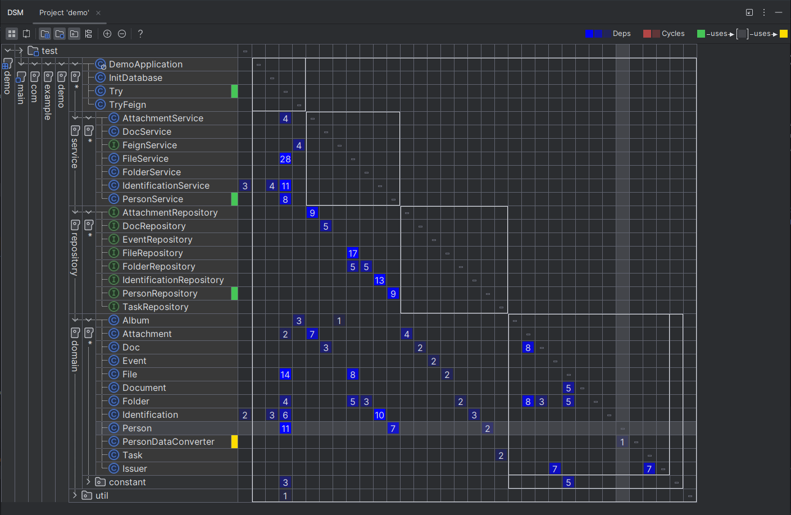

# Data Structure Matrix (DSM)

- The column shows the dependencies of the selected row.
- The row shows the dependencies on the selected row.
- The green component depends on the yellow component.

For example if we focus on the class **Person**
- It depends on 1 class which is the class **PersonDataConverter** (the yellow flags, cell 1)
- It has 3 classes that depend on it. (all the green flags, cells 11, 7 and 2)

## Links
[IntelliJ IDEA: Explore project structure with the Dependency Matrix](https://www.youtube.com/watch?v=moi49_V_4g0)

[Wikipedia](https://en.wikipedia.org/wiki/Design_structure_matrix)