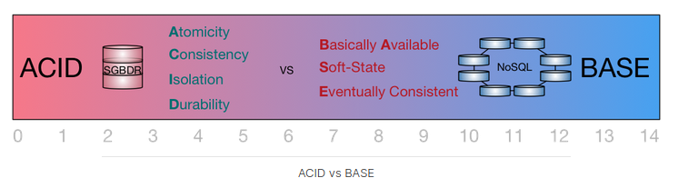
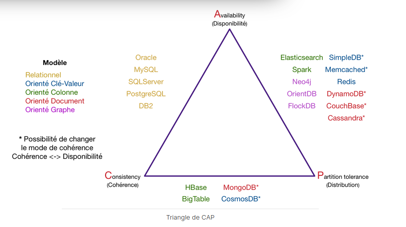

# Database

## ACID vs BASE

Pour mettre en rapport les problématiques de la base de données relationnelle, on parle de propriétés ACID pour les transactions (séquences d'opérations/requêtes) :
- Atomicité : Une transaction s’effectue entièrement ou pas du tout
- Cohérence : Le contenu d’une base doit être cohérent au début et à la fin d’une transaction
- Isolation : Les modifications d’une transaction ne sont visibles/modifiables que quand celle-ci a été validée
- Durabilité : Une fois la transaction validée, l’état de la base est permanent (non affecté par les pannes ou autre)

Toutefois, ces propriétés ne sont pas applicables dans un contexte distribué tel que le NoSQL. En effet, prenons l'exemple d'une transaction de cinq opérations (lecture/écriture) : cela implique une synchronisation entre cinq serveurs pour garantir l'atomicité, la cohérence et l'isolation. Au final, cela se traduit par des latences dans les transactions (en cours et en concurrence). Ce qui n'est pas tolérable lorsque justement on veut éviter ces latences en distribuant les calculs.

Le problème s'aggrave encore lorsque l'on distribue les données car il va falloir répliquer chaque donnée.
Pourquoi ? Tout simplement parce que si un serveur tombe en panne, il faut pouvoir garantir de retrouver toutes les données présentes sur ce serveur, donc on fait de la réplication.
Mais cela veut dire également qu'il va falloir synchroniser toutes mises à jour avec tous les réplicas de la donnée !

Du coup, les propriétés BASE ont été proposées pour caractériser les bases NoSQL :
- Basically Available : quelle que soit la charge de la base de données (données/requêtes), le système garantie un taux de disponibilité de la donnée
- Soft-state : La base peut changer lors des mises à jour ou lors d'ajout/suppression de serveurs. La base NoSQL n'a pas à être cohérente à tout instant
- Eventually consistent : À terme, la base atteindra un état cohérent

Ainsi, une base NoSQL relâche certaines contraintes, telles que la synchronisation des réplicas, pour favoriser l'efficacité. Le parallèle ACID / BASE repris du domaine de la chimie permet d'appuyer là où ça fait mal : la concurrence. L'enfer des transactions gérées par les bases de données relationnelles est transformé en paradis pour le temps de réponse en relâchant cette contrainte impossible à maintenir.

## CAP theorem
- C : Consistency (cohérence)
- A: Avaibility (disponibilité)
- P: Partition tolerance (distribution)

The Brewer theorem demonstrates that a database can support at most 2 of the three properties

## Links
[CAP theorem](https://openclassrooms.com/fr/courses/4462426-maitrisez-les-bases-de-donnees-nosql/4462471-maitrisez-le-theoreme-de-cap)

