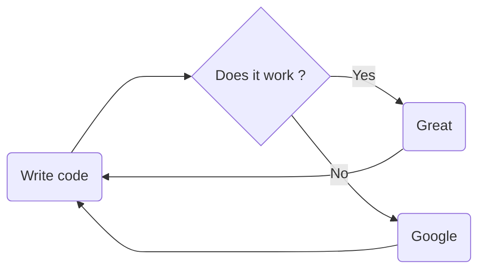
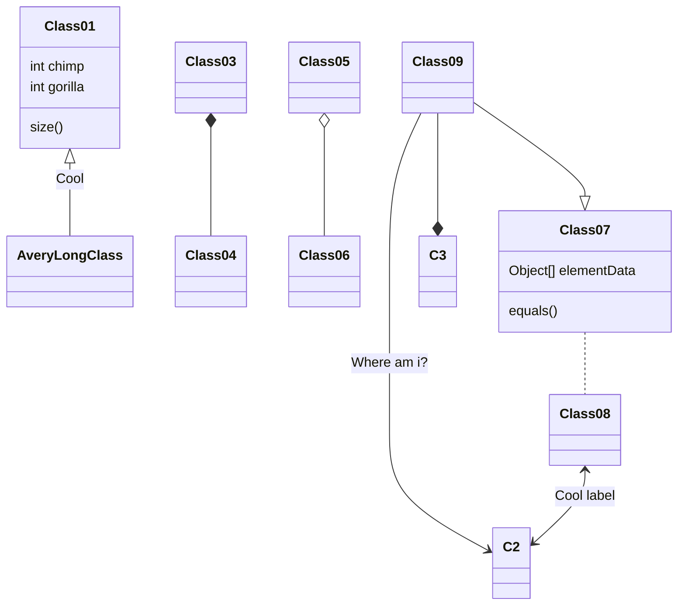
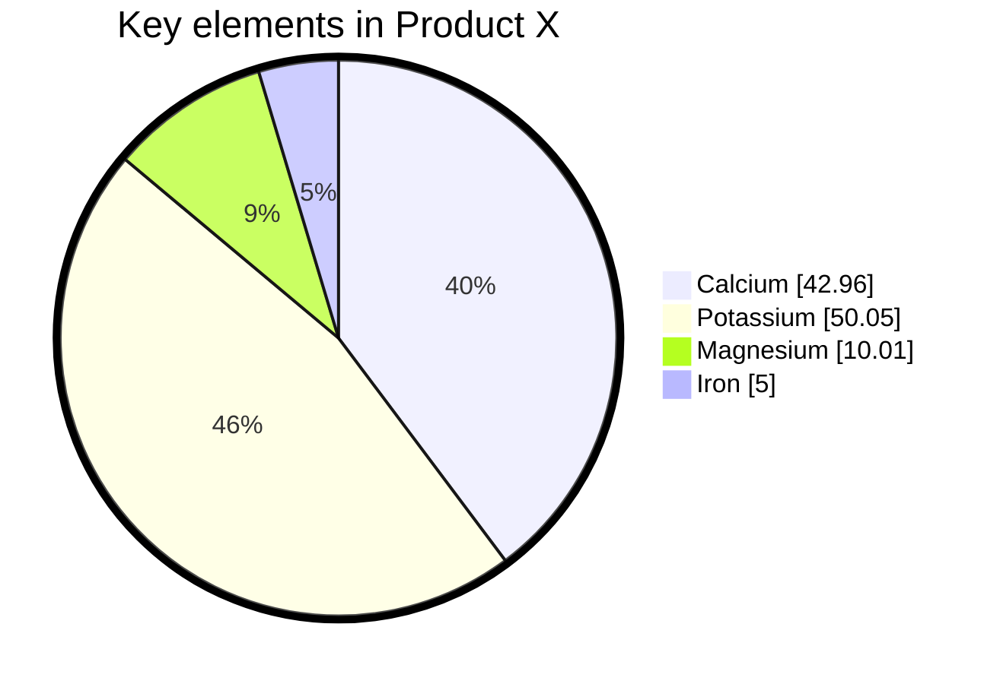
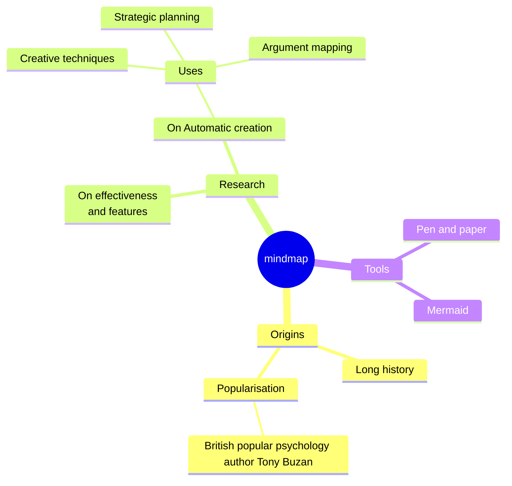

# things to examine
- Twitter snowflake ID

# Circular Dependencies in Spring
https://www.baeldung.com/circular-dependencies-in-spring

# jib
https://github.com/GoogleContainerTools/jib/tree/master/jib-maven-plugin

# Git
- git blame
- git merge
- git rebase

cloner un repo depuis un commit

# Jenkins

# Ansible

# mermaid

# Gherkin

# Cucumber

