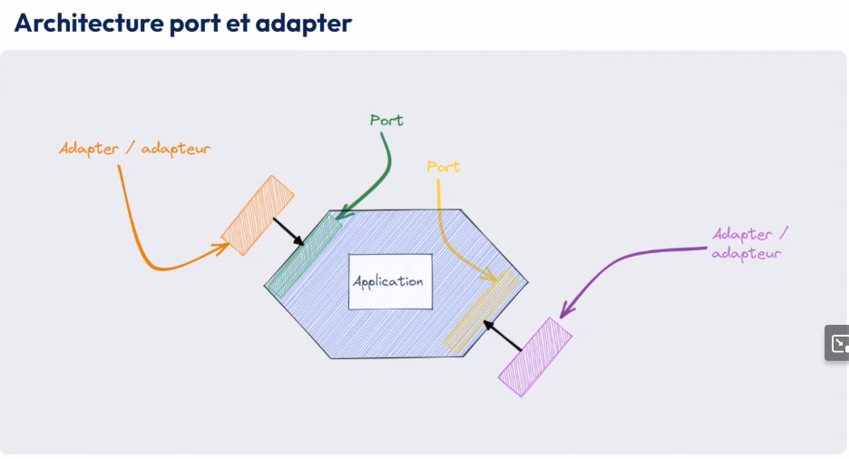
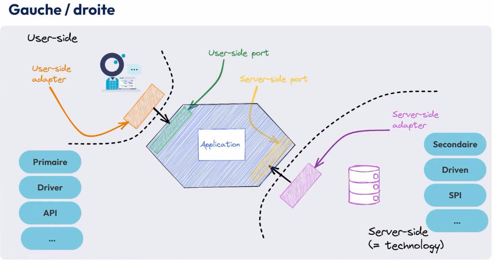

# Hexagonal architecture

also called port/adapter architecture

- one hexagon
- ports
- outside the ports : adapters

left adapters : how we use the hexagon, what the hexagon offers in term of business

right adapters : what the hexagon needs to work

different ways to name sides :
- left / right
- user side / server side (technology)
- primary / secondary
- driver / driven
- api / spi (service provider interface)

## Links
[Breizhcamp Video](https://www.youtube.com/watch?v=GG9WyeerqFA&list=PL9B1Qf4o9HXxLivhbz1JrZ-CMzNgiHlTr&index=7)
