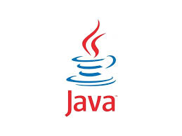

# Java

---

## Introduction

### Historique et évolution de Java

### Caractéristiques principales de Java

## Installation et configuration de l'environnement de développement (JDK, IDE)

------------------------

## Syntaxe de base et structures de contrôle

### Variables et types de données
### Opérateurs et expressions
### Structures de contrôle (boucles, conditions)

## Classes et Objets

### Définition de classes et création d'objets
### Constructeurs et méthodes
### Encapsulation et modificateurs d'accès

## Héritage et polymorphisme

### Concepts d'héritage et de polymorphisme
### Classes abstraites et interfaces
### Surcharge et redéfinition de méthodes

## Gestion des exceptions

### Introduction aux exceptions
### Blocs try-catch-finally
### Exceptions personnalisées

## Collections et génériques

### Introduction aux collections (List, Set, Map)
### Utilisation des génériques
### Classes utilitaires (Collections, Arrays)

## Flux d'Entrée/Sortie (I/O)

### Lecture et écriture de fichiers
### Flux de données (InputStream, OutputStream)
### Sérialisation et désérialisation

## Concurrence et Multithreading

### Introduction au multithreading
### Création et gestion de threads
### Synchronisation et classes concurrentes (CopyOnWriteArrayList, ConcurrentHashMap)

## Bibliothèques Standard et API Java

### Introduction aux bibliothèques standard de Java
### Utilisation des API courantes (java.util, java.time, java.nio)
### Gestion des dépendances avec Maven ou Gradle

## Développement d'Applications de Bureau

### Introduction à Swing et JavaFX
### Création d'interfaces utilisateur graphiques (GUI)
### Gestion des événements et des composants graphiques

## Développement Web avec Java

### Introduction aux servlets et JSP
### Frameworks web (Spring MVC, JSF)
### Déploiement d'applications web sur des serveurs (Tomcat, Jetty)

## Accès aux Bases de Données avec JDBC

### Introduction à JDBC
### Connexion et interaction avec une base de données
### Gestion des transactions et des pools de connexions

## Frameworks et ORM
### Introduction aux ORM (Hibernate, JPA)
### Mapping objet-relationnel
### Gestion des entités et des relations

## Développement d'Applications RESTful

### Introduction aux services web REST
### Création d'API REST avec Spring Boot
### Consommation de services web REST

## Sécurité des Applications Java

### Introduction à la sécurité des applications Java
### Authentification et autorisation
### Protection contre les vulnérabilités courantes (injection SQL, XSS)

## Projet de Développement Logiciel en Java

### Réalisation d'un projet de développement logiciel en groupe
### Application des concepts appris tout au long du cours
### Présentation et évaluation du projet

## Microservices et Architecture Modulaire

### Introduction aux microservices
### Conception et développement de microservices avec Spring Boot
### Communication entre microservices (REST, gRPC)

## Développement Mobile avec Java

### Introduction à Android et Kotlin
### Développement d'applications mobiles avec Android Studio
### Intégration de services backend avec des applications mobiles

## Tests et Qualité du Code

### Introduction aux tests unitaires et d'intégration (JUnit, TestNG)
### Tests de performance et de charge
### Outils de qualité du code (SonarQube, Checkstyle)

## Déploiement et DevOps

### Introduction aux pratiques DevOps
### Déploiement continu et intégration continue (CI/CD)
### Outils de déploiement (Docker, Kubernetes, Jenkins)
