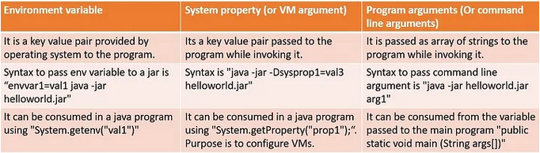

# Java

## Alternatives sous linux
https://www.baeldung.com/linux/java-choose-default-version

### Lister les versions de Java installées sur la machine
```
update-alternatives --list java
/opt/java-21/bin/java
/usr/lib/jvm/java-11-openjdk-amd64/bin/java
```
### Sélectionner une version de Java
```
update-alternatives --config java
* 0            /usr/lib/jvm/java-11-openjdk-amd64/bin/java   1111      mode automatique
  1            /opt/java-21/bin/java                         1         mode manuel
  2            /usr/lib/jvm/java-11-openjdk-amd64/bin/java   1111      mode manuel
  
Appuyez sur <Entrée> pour conserver la valeur par défaut[*] ou choisissez le numéro sélectionné :
```

### Surcharger une méthode
La surcharge d’une méthode ou d’un constructeur permet de définir plusieurs fois une même méthode/constructeur avec des arguments différents.

## jshell
REPL (READ EVALUATE PRINTL LOOP)

Exemple 1

```
jshell> Integer.parseInt("20")
$2 ==> 20
```

Exemple 2

```
jshell> Integer.parseInt("")
|  Exception java.lang.NumberFormatException: For input string: ""
|        at NumberFormatException.forInputString (NumberFormatException.java:68)
|        at Integer.parseInt (Integer.java:662)
|        at Integer.parseInt (Integer.java:770)
|        at (#3:1)
```

## Initialisateur d'instance

```
public class Person {

	private long dateCreation = System.currentTimeMillis();
	private String nom;
	private static Integer number;

	{
		// ceci est un bloc non statique  

	}

	static {
		// ceci est un bloc statique  
		number = 12;
	}

	public Person() {
		this.nom = "indéfini";
	}

	public Person(String nom) {
		this.nom = nom;
	}
}
```
## Program argument, VM argument, Environment variable
Program arguments are arguments passed to your program and available in the args array of your main method  
```public static void main(String[] args)```

VM arguments are passed to the virtual machine and are designed to instruct the VM to do something.
You can do things like control the heap size, etc.
They can be accessed by your program via a call to ```System.getProperty()```

Environment variable is a key value pair provided by the operating system to the program
They can be accessed by your program via a call to ```System.getEnv()```

```
envvar1=val1 java -jar -Dsysprop1=val2 HelloWorld-1.0-SNAPSHOT.jar arg1
```

```
public class Hello {

	public static void main(String[] args) {
		System.out.println("Environment Variable envvar1 is: " + System.getenv("envvar1"));
		System.out.println("System property sysprop1 is: " + System.getProperty("sysprop1"));
		if (args != null && args.length > 0) {
			System.out.println("Command line arguments are: ");
			for (String arg : args) {
				System.out.println(arg);
			}
		}
	}
}
```


## StackWalker

## ProcessHandle

## Profiling
VisualVM


