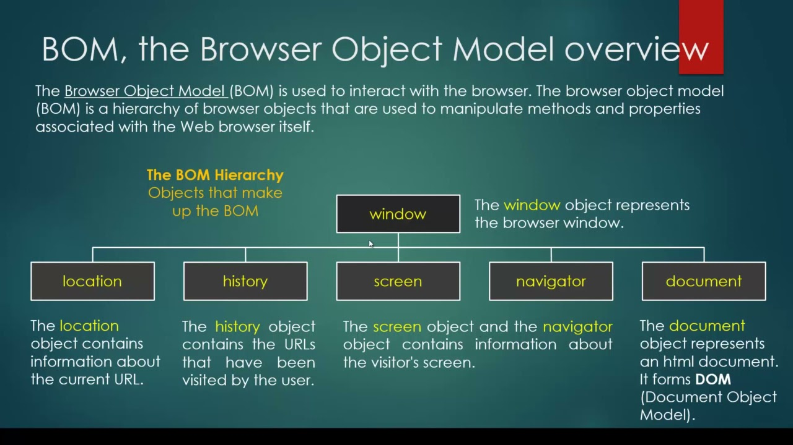

# Javascript

[Chaîne Youtube From scratch](https://www.youtube.com/watch?v=Ew7KG2j8eII)

[Tutoriel Pierre Giraud](https://www.pierre-giraud.com/javascript-apprendre-coder-cours/)

## Les variables

### Déclaration avec 'var'

- Portée de fonction : Les variables déclarées avec var ont une portée de fonction. Cela signifie qu'elles sont
  accessibles dans toute la fonction dans laquelle elles sont déclarées, même si elles sont déclarées à l'intérieur d'un
  bloc (comme une boucle for ou une condition if).
- Hoisting : Les déclarations de variables avec var sont "hoisted" (remontées) au début de leur portée. Cela signifie
  que la déclaration est déplacée en haut de la fonction ou du script, mais l'initialisation reste à l'endroit où elle
  est écrite.

```
function example() {
    console.log(x); // undefined (signifie plutôt non initialisé)
    var x = 10;
    console.log(x); // 10
}
```

Les variables déclarées avec var peuvent être réinitialisées dans la même portée.

```
var x = 10;
var x = 20; // Réinitialisation valide
console.log(x); // 20
```

### Déclaration avec 'let'

- Portée de bloc : Les variables déclarées avec let ont une portée de bloc. Cela signifie qu'elles sont accessibles
  uniquement dans le bloc (par exemple, une boucle for ou une condition if) dans lequel elles sont déclarées.
- Hoisting : Les déclarations de variables avec let sont également "hoisted", mais elles ne sont pas initialisées.
  Accéder à une variable let avant sa déclaration entraîne une ReferenceError.

### Différences de portée entre var et let

Lorsqu’on utilise la syntaxe let pour définir une variable à l’intérieur d’une fonction en JavaScript, la variable va
avoir une portée dite « de bloc » : la variable sera accessible dans le bloc dans lequel elle a été définie et dans les
blocs que le bloc contient.

En revanche, en définissant une variable avec le mot clef var dans une fonction, la variable aura une portée élargie
puisque cette variable sera alors accessible dans tous les blocs de la fonction.

```
function portee() {
  let x = 1;
  var y = 2;

  if (true) {
    let x = 5;
    var y = 10; // même variable qu'au dessus, y passe de la valeur 2 à 10
    console.log("x dans bloc if = " + x);
    console.log("y dans bloc if = " + y);
  }
  console.log("x en dehors du bloc if = " + x);
  console.log("y en dehors du bloc if = " + y);
}
portee();
```

Affichage dans la console :

x dans bloc if = 5  
y dans bloc if = 10  
x en dehors du bloc if = 1  
y en dehors du bloc if = 10

```
function example() {
    console.log(x); // ReferenceError: Cannot access 'x' before initialization
    let x = 10;
    console.log(x); // 10
}
```

Les variables déclarées avec let ne peuvent pas être réinitialisées dans la même portée.

```
let x = 10;
let x = 20; // SyntaxError: Identifier 'x' has already been declared
```

Exemple Comparatif var / let

```
function varExample() {
  if (true) {
    var x = 10;
  }
  console.log(x); // 10 (accessible en dehors du bloc)
}
function letExample() {
  if (true) {
    let y = 20;
  }
  console.log(y); // ReferenceError: y is not defined (non accessible en dehors du bloc)
}
```

### Déclaration d'une constante

```
const prenom = "Olivier";
console.log(prenom); // affiche 'Olivier' dans la console
prenom = "Paul"; // non autorisé (Uncaught TypeError: invalid assignment to const 'prenom')
```

### Variables de type chaîne de caractères

```
var prenom = "Olivier"
var prenom = 'Olivier'
var phrase = "Je m'appelle Olivier." // ça marche aussi avec des guillements simples
var phrase = 'Je m\'appelle Olivier.' // échappement du caractère de fermeture de la chaine
```

#### Concaténation de chaînes de caractères

```
var chaine1 = "Hello";
var chaine2 = chaine1 + " world !";
console.log(chaine2); // affiche 'Hello world !'
var chaine3 = `${chaine1} world !`;  // autre façon de concaténer, utile si le nombre de concaténations est élevé.
console.log(chaine2); // affiche 'Hello world !'
```

## Les types de données

```
let string = "chaîne de caractères";
let number = 24;
let boolean = false;
let array = ["A", "B", "C"];
let object = {
    prenom : "Olivier",
    age : 34,
    ville : "Biarritz"
}
let arbre; // affiche 'undefined' dans la console
```

## Les opérateurs

```
let addition = 14 + 5;
console.log(addition); // affiche 19

let subtraction = 14 - 4;
console.log(subtraction); // affiche 10

let division = 12 / 3;
console.log(division); // affiche 4

let division2 = 10 / 4;
console.log(division2); // affiche 2.5

let multiplication = 15 * 4;
console.log(multiplication); // affiche 60

let powerOf = 2 ** 3;
console.log(powerOf); // affiche 8

let modulo = 10 % 4;
console.log(modulo); // affiche 2
```

### Les opérateurs d'affectation

#### Opérateur ++

```
let total = 10;
total++;
console.log(total); // affiche 11
```

#### Opérateur --

```
let total = 10;
total--;
console.log(total); // affiche 9
```

#### Opérateur +=

```
let total = 10;
total += 5;
console.log(total); // affiche 15
```

#### Opérateur -=

```
let total = 10;
total -= 2;
console.log(total); // affiche 8
```

#### Opérateur *=

```
let total = 10;
total *= 2;
console.log(total); // affiche 20
```

#### Opérateur /=

```
let total = 10;
total /= 4;
console.log(total); // affiche 2.5
```

## Structures de contrôle

### Structure if

```
let x = 2;
let y = 5;
if (x > y) {
  alert("x > y");
} else {
  alert("y > x");
}
```

### Tester l'existence d'une variable

```
if (x) {  // test l'existence de la variable 'x'
  console.log("x existe.");
}
```

### Tester l'égalité de deux variables en type et valeur (===)

```
let x = 2;
let y = 5;
if (x = y) {  // ne teste pas l'égalité mais on affecte le contenu de y à x
  console.log(x); // affiche 5
}
```

```
let x = 2;
let y = 5;
if (x === y) { // teste l'égalité de type et de valeur de x et y
  console.log("x et y égaux");
} else {
  console.log("pas égaux"); // cette ligne est affichée
}
```

### Tester l'égalité de deux variables en valeur (==)

```
let x = 2;
let y = "2";
if (x == y) { // teste l'égalité de valeurs de x et y
  console.log("x et y ont la même valeur"); // cette ligne est affichée
} else {
  console.log("x et y n'ont pas la même valeur");
}
```

### Opérateurs logiques

#### Opérateur ET

Lorsqu’il est utilisé avec des valeurs booléennes, renvoie true si toutes les comparaisons sont évaluées à true ou false
sinon

```
let x = 2;
let y = 10;
if (x < y && x > 1) {
  console.log("condition vraie"); // est affichée
}
```

#### Opérateur OU

Lorsqu’il est utilisé avec des valeurs booléennes, renvoie true si au moins l’une des comparaisons est évaluée à true ou
false sinon

```
let x = 2;
let y = 10;
if (x < y || x > 3) {
  console.log("condition vraie"); // est affichée car x < y est vrai
}
```

#### Opérateur NOT

Renvoie false si une comparaison est évaluée à true ou renvoie true dans le cas contraire

```
let boolean = false;
if (!boolean) {
  console.log("condition vraie"); // est affichée
}
```

## Les fonctions

```
function doSomething() {
  console.log("Je fais un truc");
}
doSomething(); // appel de la fonction
```

```
function multiplication(a, b) {
  console.log(a + " * " + b + " = " + a * b);
}
multiplication(2, 10);
```

```
function add(a, b) {
  return a + b;
}
const v1 = add(1, 2);
const v2 = add(4, 5);
console.log(add(v1, v2)); // affiche 12
```

### Lambda Expressions

```
const addition = (a, b) => {
  return a + b;
};
console.log(addition(2, 10));
```

## Les objets

```
const object = {
  firstName: "John",
  lastName: "Doe",
  age: 35,
  height: 1.80,
  weight: 75,
  imc : () => {
  return object.weight / (object.height * object.height);
  }
}
console.log(object.imc()); // affiche 23.15
```

## Prototype

En JavaScript, un prototype est un mécanisme fondamental qui permet aux objets d'hériter de propriétés et de méthodes
d'autres objets. Chaque fonction en JavaScript a une propriété appelée prototype, qui est un objet auquel des propriétés
et des méthodes peuvent être ajoutées. Lorsqu'une fonction est utilisée comme un constructeur (avec le mot-clé new),
l'objet créé hérite des propriétés et des méthodes du prototype de cette fonction.

```
let str = "Bonjour";
String.prototype.hello = () => {
  return "Hello";
};
console.log(str, str.hello()); // affiche Bonjour Hello
```

## Les itérateurs

### forEach

```
const tab = [1, 2, 3, 42];
tab.forEach((elem) => {
  console.log(elem); // affiche les élements du tableau
});
```

### map

```
const tab = [1, 2, 3, 42];
const tab2 = tab.map((elem) => {
  return elem + 1;
});
console.log(tab2); // affiche Array(4) [ 2, 3, 4, 43 ]
```

### filter

```
const tab = [1, 2, 3, 42];
const filtered = tab.filter((elem) => {
  return elem < 10;
});
console.log(filtered); // affiche Array(4) [ 2, 3, 4]
```

### reduce

```
const tab = [1, 2, 3, 42];
const reduced = tab.reduce((acc, element) => {
return acc + element;
}, 0);
console.log(reduced); // affiche 48
```

## La portée des variables

La portée d’une variable désigne l’espace du script dans laquelle elle va être accessible.
En JavaScript, il n’existe que deux espaces de portée différents :

- l’espace global
- l’espace local

Pour rester très simple, l’espace global désigne l’entièreté d’un script à l’exception de l’intérieur de nos fonctions.
L’espace local désigne, à l’inverse, l’espace dans une fonction.

Une variable définie dans l’espace global d’un script va être accessible à travers tout le script, même depuis une
fonction. En revanche, une variable définie dans une fonction n’est accessible que dans cette même fonction et ne peut
pas être manipulée depuis l’espace global du script.

## Le Document Object Model (DOM)

Le Document Object Model est une interface de programmation qui permet à des scripts d'examiner et de modifier le
contenu du navigateur Web. Par le DOM, la composition d'un document HTML est représentée sous forme d'un jeu d'objets -
lesquels peuvent représenter une fenêtre, une phrase ou un style, par exemple - reliés selon une structure en arbre.


Le nœud racine est le noeud _html_.

### Ajouter une classe de style à un nœud

Supposons que nous ayons défini cette classe CSS

```
.question-click {
    background: rgb(47,47,47);
    border-radius: 30px;
    border: 6px dashed pink;
}
```

Pour ajouter cette classe au nœud myNode

```
myNode.classList.add("question-click");
```

### Retirer une classe de style d'un nœud

Pour retirer la classe du nœud myNode

```
myNode.classList.remove("question-click");
```

Pour ajouter la classe si elle n'est pas associée au nœud et pour la retirer si elle est déjà associée :

```
myNode.classList.toggle("question-click");
```

## CSS

### Gestion des priorités

La spécificité des sélecteurs joue un rôle crucial. Voici l'ordre de spécificité des sélecteurs du plus faible au plus
élevé :

- Sélecteurs de type (par exemple, div, p)
- Sélecteurs de classe (par exemple, .classname)
- Sélecteurs d'attribut (par exemple, [type="text"])
- Sélecteurs d'ID (par exemple, #idname)
- Sélecteurs inline (par exemple, `<div style="color: red;">`)

## Gestion des événements

### addEventListener

```
button.addEventListener("click", () => {
  alert("click");
});
```

## Browser Object Model (BOM)



### window object

represents the browser window

some methods :

* alert
* confirm
* prompt
* setTimeout
* setInterval

#### location object

#### history object

#### location object

some methods :

* replace
  Redirige vers l'URL indiquée

```
location.replace("http://lemonde.fr");
```

#### navigator object

some methods :

* userAgent

#### document object

## setProperty

## try catch

```
try {
  if (tab[4]) console.log("OK");
  else throw new Error("wrong");
} catch (error) {
  console.error(error);
}
console.log("ça marche encore");
```

## Recursivité

```
const tab = [1, 2, 3, 42];
const sum = (table, i) => {
if (!tab[i]) return 0;
else return tab[i] + sum(table, i + 1);
};
console.log(sum(tab, 0)); // affiche 48
```

## Node.js

Node.js est un environnement d'exécution JavaScript côté serveur. Il permet aux développeurs d'utiliser JavaScript pour
écrire des scripts côté serveur

Installer Node.js à partir de ce site [Node.js](https://nodejs.org)

Définir le chemin vers le répertoire de Node.js dans le fichier _.bashrc_

Lancer la commande `node -v` dans le terminal

## Babel

[Babel](https://babeljs.io/) est un compilateur JavaScript

Créer un répertoire projet, par exemple `/home/olivier/dev/Javascript/node/`

Se placer dans le répertoire `node`

Exécuter la commande

```
npm init -y
```

puis la commande

```
npm install --save-dev babel-cli
```

Le fichier `package.json` a la structure suivante :

```
{
  "name": "node",
  "version": "1.0.0",
  "main": "test.js",
  "scripts": {
    "test": "echo \"Error: no test specified\" && exit 1"
  },
  "keywords": [],
  "author": "",
  "license": "ISC",
  "description": "",
  "devDependencies": {
    "babel-cli": "^6.26.0"
  }
}
```

Modifier le fichier comme ceci

```
{
  "name": "node",
  "version": "1.0.0",
  "main": "test.js",
  "scripts": {
    "start": "node test.js"
  },
  "keywords": [],
  "author": "",
  "license": "ISC",
  "description": "",
  "devDependencies": {
    "babel-cli": "^6.26.0"
  }
}
```

Lancer la commande

```
npm run start
```

Voici le résultat

```
> node@1.0.0 start
> node test.js

Hello world !
```

Modifier le fichier comme ceci pour utiliser Babel à la place de Node

```
{
  "name": "node",
  "version": "1.0.0",
  "main": "test.js",
  "scripts": {
    "start": "babel-node test.js"
  },
  "keywords": [],
  "author": "",
  "license": "ISC",
  "description": "",
  "devDependencies": {
    "babel-cli": "^6.26.0"
  }
}

