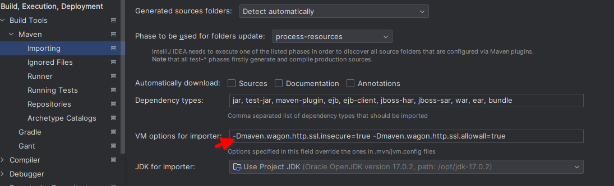

## Différence entre dependencyManagement et dependencies

Dans le pom parent la différence principale entre `<dependencies>` et `<dependencyManagement>`

- Les artifacts spécifiés dans la section `<dependencies>` seront toujours inclus en tant que dépendances dans les modules fils
- Les artifacts spécifiés dans la section `<dependencyManagement>` ne seront inclus dans les modules fils que si ils sont également définis dans la section <dependencies> du module fils

## settings
https://www.baeldung.com/maven-settings-xml

While using Maven, we keep most of the project-specific configuration in the pom.xml.
Maven provides a settings file, `settings.xml`, which allows us to specify which local and remote repositories it will use. We can also use it to store settings that we don't want in our source code, such as credentials.
It's similar to a pom.xml file but is defined globally or per user.

## dependencies tree
mvn dependency:tree

## Exclure une dépendence
<dependency>
    <groupId>sample.ProjectA</groupId>
    <artifactId>Project-A</artifactId>
    <version>1.0</version>
    <scope>compile</scope>
    <exclusions>
        <exclusion>
            <groupId>com.ariadnext.module-utils</groupId>
            <artifactId>m-utils-common</artifactId>
        </exclusion>
    </exclusions> 
</dependency>

# Avec Maven le root project est forcément de type pom
'packaging' with value 'jar' is invalid. Aggregator projects require 'pom' as packaging.

## déployer un artifact sur Nexus
`mvn deploy -Dmaven.wagon.http.ssl.insecure=true -Dmaven.wagon.http.ssl.allowall=true`
L'option `-Dmaven.wagon.http.ssl.insecure=true -Dmaven.wagon.http.ssl.allowall=true` est utilisée pour ne pas utiliser de certificat

Depuis IntelliJ

